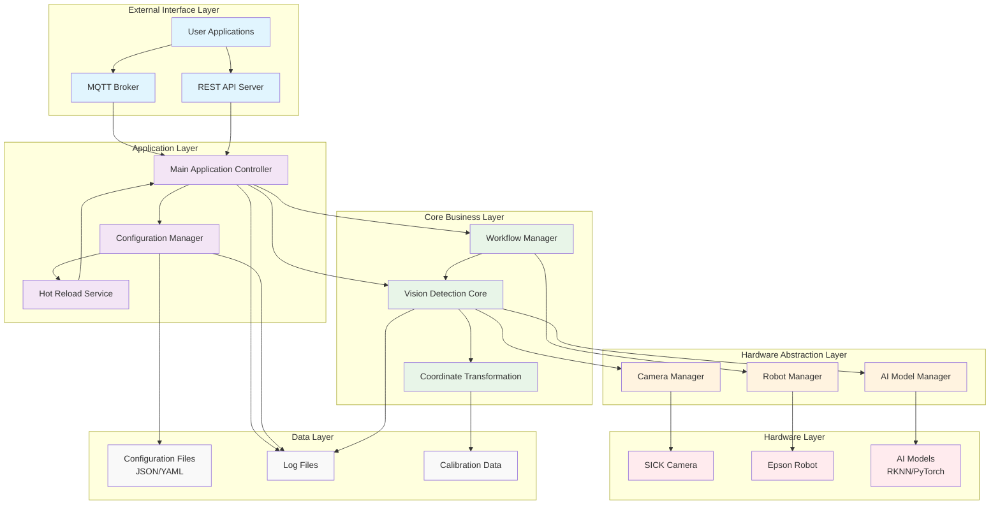
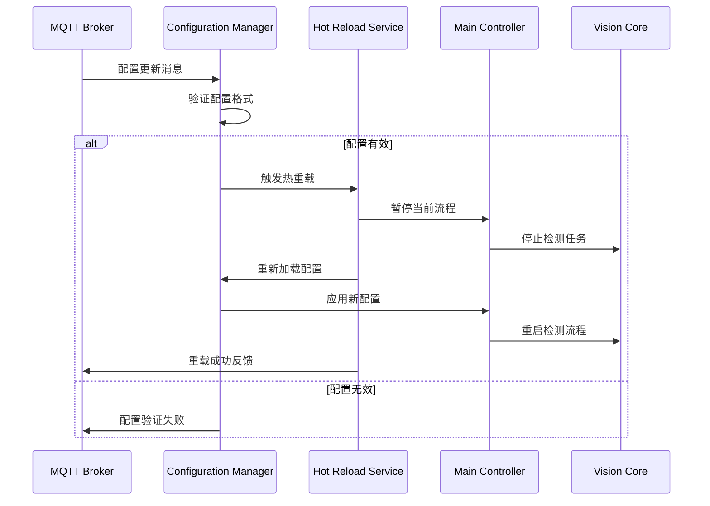
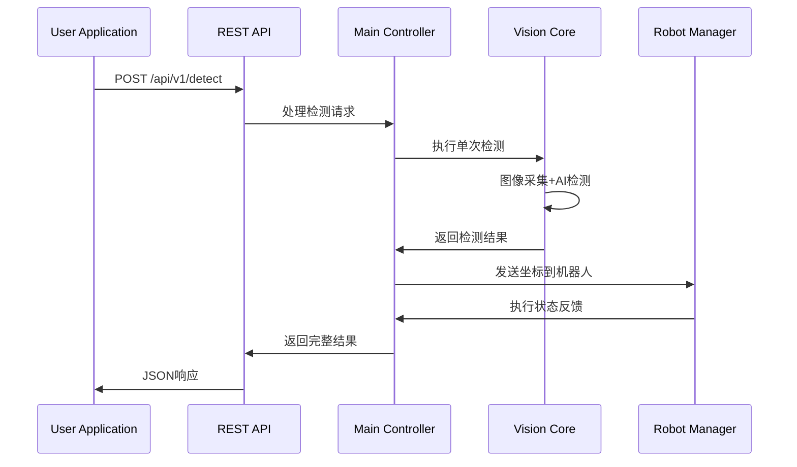
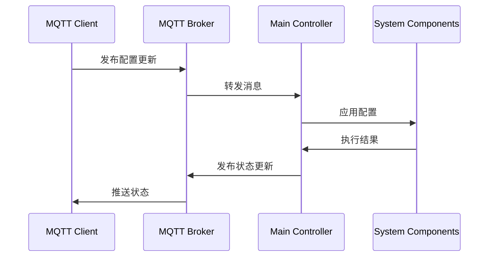

# SickVision 无界面重构系统架构设计

## 📋 项目概述

本项目是对原有SickVision智能视觉系统的无界面重构，旨在提供更加灵活的部署方式和更强的可配置性。系统保留了原有的核心检测功能，并增加了配置热重载、MQTT通信和REST API等现代化特性。

### 🎯 核心目标
- **无界面运行**: 去除GUI依赖，支持服务器端部署
- **配置热重载**: 支持运行时动态更新配置，无需重启服务
- **MQTT通信**: 通过MQTT协议实现与外部系统的松耦合通信
- **API接口**: 提供REST API接口支持直接调用
- **高可用性**: 提供稳定可靠的工业级服务

## 🏗️ 系统架构图



## 📚 架构层次详解

### 1. 外部接口层 (External Interface Layer)

#### MQTT Broker
- **功能**: 消息队列通信中间件
- **用途**: 接收配置更新、系统控制指令
- **主题设计**:
  - `sickvision/config/update` - 配置更新
  - `sickvision/control/start` - 启动检测
  - `sickvision/control/stop` - 停止检测
  - `sickvision/status/heartbeat` - 心跳状态
  - `sickvision/result/detection` - 检测结果推送

#### REST API Server
- **功能**: HTTP API接口服务
- **端点设计**:
  - `GET /api/v1/status` - 系统状态查询
  - `POST /api/v1/detect` - 单次检测请求
  - `PUT /api/v1/config` - 配置更新
  - `GET /api/v1/config` - 配置查询
  - `POST /api/v1/calibration` - 坐标标定

### 2. 应用层 (Application Layer)

#### Main Application Controller
- **职责**: 整个系统的主控制器
- **功能**:
  - 初始化各个子系统
  - 协调模块间通信
  - 处理外部请求
  - 管理系统生命周期

#### Configuration Manager
- **职责**: 配置文件管理
- **功能**:
  - 配置文件读取和解析
  - 配置格式验证
  - 配置版本管理
  - 配置变更通知

#### Hot Reload Service
- **职责**: 热重载服务
- **功能**:
  - 监听配置文件变化
  - 触发系统重载
  - 保证重载过程的原子性
  - 提供回滚机制

### 3. 核心业务层 (Core Business Layer)

#### Vision Detection Core
- **职责**: 视觉检测核心逻辑
- **功能**:
  - 图像采集流程控制
  - AI检测结果处理
  - 检测流水线管理
  - 结果后处理

#### Coordinate Transformation
- **职责**: 坐标系转换
- **功能**:
  - 相机坐标到机器人坐标转换
  - 标定数据管理
  - 转换精度验证
  - 多坐标系支持

#### Workflow Manager
- **职责**: 工作流程管理
- **功能**:
  - 检测流程状态机
  - PLC信号处理
  - 多机器人任务分配
  - 异常处理和恢复

### 4. 硬件抽象层 (Hardware Abstraction Layer)

#### Camera Manager
- **职责**: 相机设备管理
- **功能**:
  - SICK相机连接管理
  - 图像采集控制
  - 相机参数配置
  - 设备状态监控

#### Robot Manager
- **职责**: 机器人设备管理
- **功能**:
  - 多机器人连接管理
  - 命令发送和状态监听
  - 负载均衡
  - 故障检测和恢复

#### AI Model Manager
- **职责**: AI模型管理
- **功能**:
  - 模型加载和卸载
  - 模型预热
  - 推理引擎管理
  - 性能监控

## 🔄 核心流程设计

### 热重载流程



### API调用流程



### MQTT通信流程



## 🛠️ 技术实现方案

### 1. 配置管理器实现

#### 技术栈
- **文件监控**: watchdog库
- **配置验证**: jsonschema库
- **配置格式**: JSON/YAML

#### 核心代码结构
```python
class ConfigurationManager:
    def __init__(self, config_dir: str):
        self.config_dir = config_dir
        self.configs = {}
        self.validators = {}
        self.observer = Observer()
        
    def load_configs(self):
        """加载所有配置文件"""
        pass
        
    def validate_config(self, config_type: str, config_data: dict):
        """验证配置格式"""
        pass
        
    def hot_reload(self, config_type: str):
        """热重载指定配置"""
        pass
```

#### 配置文件结构
```
config/
├── camera.json          # 相机配置
├── robots.json          # 机器人配置  
├── model.json           # AI模型配置
├── coordinate.json      # 坐标转换配置
├── mqtt.json           # MQTT配置
├── api.json            # API配置
└── schemas/            # 配置验证模式
    ├── camera.schema.json
    ├── robots.schema.json
    └── ...
```

### 2. MQTT集成实现

#### 技术栈
- **MQTT客户端**: paho-mqtt
- **消息格式**: JSON
- **QoS级别**: 1 (至少一次传递)

#### 主题设计
```yaml
sickvision/
├── config/
│   ├── update          # 配置更新 (订阅)
│   └── reload/response # 重载结果 (发布)
├── control/
│   ├── start           # 启动检测 (订阅)
│   ├── stop            # 停止检测 (订阅)
│   └── status          # 控制状态 (发布)
├── detection/
│   ├── trigger         # 检测触发 (订阅)
│   └── result          # 检测结果 (发布)
└── system/
    ├── heartbeat       # 系统心跳 (发布)
    └── error          # 错误信息 (发布)
```

#### 消息格式示例
```json
// 配置更新消息
{
    "timestamp": "2024-01-01T10:00:00Z",
    "config_type": "camera",
    "action": "update",
    "data": {
        "ip": "192.168.1.100",
        "port": 2122
    }
}

// 检测结果消息
{
    "timestamp": "2024-01-01T10:00:00Z",
    "detection_id": "det_12345",
    "objects": [
        {
            "class": "part",
            "confidence": 0.95,
            "camera_coords": [100, 200, 50],
            "robot_coords": [300, 400, 150],
            "angle": 45.5
        }
    ],
    "robot_target": "epson1",
    "status": "success"
}
```

### 3. REST API实现

#### 技术栈
- **Web框架**: FastAPI
- **异步支持**: asyncio
- **文档生成**: Swagger/OpenAPI
- **数据验证**: Pydantic

#### API端点设计
```python
from fastapi import FastAPI
from pydantic import BaseModel

app = FastAPI(title="SickVision API", version="2.0.0")

class DetectionRequest(BaseModel):
    robot_name: str = "epson1"
    timeout: int = 30
    
class DetectionResponse(BaseModel):
    success: bool
    detection_id: str
    objects: List[DetectedObject]
    execution_time: float

@app.post("/api/v1/detect", response_model=DetectionResponse)
async def detect(request: DetectionRequest):
    """执行单次检测"""
    pass

@app.get("/api/v1/status")
async def get_status():
    """获取系统状态"""
    pass

@app.put("/api/v1/config/{config_type}")
async def update_config(config_type: str, config_data: dict):
    """更新配置"""
    pass
```

### 4. 热重载机制实现

#### 重载策略
1. **优雅停止**: 等待当前任务完成
2. **状态保存**: 保存必要的运行状态
3. **配置更新**: 重新加载配置文件
4. **服务重启**: 重新初始化服务组件
5. **状态恢复**: 恢复之前的运行状态

#### 关键代码
```python
class HotReloadService:
    def __init__(self, main_controller):
        self.main_controller = main_controller
        self.reload_lock = asyncio.Lock()
        
    async def reload_config(self, config_type: str):
        """热重载配置"""
        async with self.reload_lock:
            try:
                # 1. 暂停相关服务
                await self.pause_services(config_type)
                
                # 2. 重新加载配置
                new_config = self.config_manager.reload(config_type)
                
                # 3. 应用新配置
                await self.apply_config(config_type, new_config)
                
                # 4. 重启服务
                await self.resume_services(config_type)
                
                return {"status": "success"}
            except Exception as e:
                # 回滚配置
                await self.rollback_config(config_type)
                raise e
```

## 🚀 部署指南

### 1. 环境要求

#### 硬件要求
- **CPU**: ARM64 或 x86_64
- **内存**: 最小4GB，推荐8GB
- **存储**: 最小10GB可用空间
- **网络**: 千兆以太网

#### 软件要求
- **操作系统**: Ubuntu 20.04+ 或 CentOS 7+
- **Python**: 3.8+
- **依赖服务**: MQTT Broker (Mosquitto推荐)

### 2. 安装步骤

#### 基础环境安装
```bash
# 更新系统
sudo apt update && sudo apt upgrade -y

# 安装Python依赖
sudo apt install python3.8 python3-pip python3-venv -y

# 安装MQTT Broker
sudo apt install mosquitto mosquitto-clients -y
sudo systemctl enable mosquitto
sudo systemctl start mosquitto
```

#### 项目部署
```bash
# 克隆项目
git clone <repository-url>
cd SickVision

# 创建虚拟环境
python3 -m venv venv
source venv/bin/activate

# 安装依赖
pip install -r requirements.txt

# ARM64平台安装RKNN
pip install rknn_toolkit2-2.3.2-cp310-cp310-manylinux_2_17_aarch64.manylinux2014_aarch64.whl
```

#### 配置文件设置
```bash
# 复制配置模板
cp config/templates/* config/

# 编辑配置文件
vim config/camera.json
vim config/robots.json
vim config/mqtt.json
```

### 3. 服务启动

#### 开发模式
```bash
# 启动无界面版本
python run_headless.py --config-dir config --mqtt-config config/mqtt.json
```

#### 生产模式
```bash
# 使用systemd管理服务
sudo cp deployment/sickvision.service /etc/systemd/system/
sudo systemctl enable sickvision
sudo systemctl start sickvision
```

#### Docker部署
```bash
# 构建镜像
docker build -t sickvision:2.0 .

# 运行容器
docker run -d \
  --name sickvision \
  --network host \
  -v $(pwd)/config:/app/config \
  -v $(pwd)/models:/app/models \
  -v $(pwd)/logs:/app/logs \
  sickvision:2.0
```

### 4. 监控和维护

#### 日志监控
```bash
# 查看实时日志
tail -f logs/sickvision.log

# 使用journalctl查看系统日志
sudo journalctl -u sickvision -f
```

#### 健康检查
```bash
# API健康检查
curl http://localhost:8000/api/v1/status

# MQTT连接检查
mosquitto_pub -h localhost -t sickvision/health/check -m "ping"
```

## 📊 性能优化

### 1. 并发处理
- 使用异步编程提高并发性能
- 多线程处理图像采集和AI推理
- 连接池管理硬件设备连接

### 2. 内存管理
- 图像数据及时释放
- 模型预热和缓存
- 配置对象复用

### 3. 网络优化
- MQTT消息压缩
- API响应缓存
- 连接保活机制

## 🔒 安全考虑

### 1. 网络安全
- MQTT认证和授权
- API访问令牌
- 网络隔离和防火墙

### 2. 数据安全
- 配置文件加密存储
- 敏感信息脱敏
- 日志数据保护

### 3. 系统安全
- 权限最小化原则
- 定期安全更新
- 异常行为监控

## 🧪 测试策略

### 1. 单元测试
- 各模块功能测试
- 配置验证测试
- API接口测试

### 2. 集成测试
- 硬件设备连接测试
- 端到端流程测试
- 性能压力测试

### 3. 部署测试
- 不同环境兼容性测试
- 热重载功能测试
- 故障恢复测试

## 📈 未来扩展

### 1. 功能扩展
- 支持更多相机类型
- 增加更多AI模型
- 扩展机器人品牌支持

### 2. 架构优化
- 微服务架构迁移
- 云原生部署支持
- 边缘计算优化

### 3. 运维增强
- 可视化监控面板
- 自动化运维工具
- 智能告警系统

---

## 📞 技术支持

如有技术问题或建议，请通过以下方式联系：

- **项目仓库**: [GitHub Issues](https://github.com/your-repo/issues)
- **技术文档**: [Wiki页面](https://github.com/your-repo/wiki)
- **邮件支持**: support@sickvision.com

---

**注意**: 本文档描述的是SickVision 2.0无界面重构版本的系统架构，实施前请充分评估现有系统的兼容性和迁移成本。 